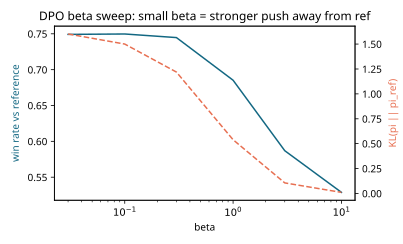
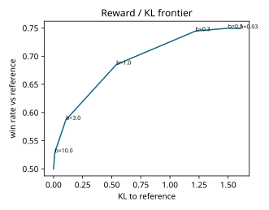
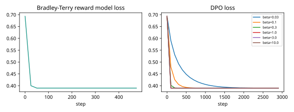

# Results: ai-learn-23-preference-tuning-dpo

Real output of `python run_smoke.py` (seed 42, CPU, 1.6 s wall time).

## Setup
- 400 train and 300 test prompts, each with 6 candidate responses described by features ['helpful', 'correct', 'safe', 'verbose', 'hedging'].
- The reference policy is linear-softmax with theta_ref=[0.4, 0.2, 0.3, 0.9, 0.3] (it likes verbose, hedgy answers).
- Preference pairs: 3000 train and 1500 test pairs, sampled from pi_ref and labelled by a Bradley-Terry judge on a hidden true reward
  (linear, with a quadratic penalty on excess verbosity). The labels match the true ordering 0.838 of the time on test pairs.

## Reward model (Bradley-Terry, linear)
- Test pairwise accuracy vs labels: **0.822**. vs the true ordering: 0.916. Train: 0.817.
- Learned weights: helpful=0.8748 correct=1.411 safe=0.715 verbose=-0.002 hedging=-0.417
- True linear weights: helpful=1.0 correct=1.5 safe=0.7 verbose=0.6 hedging=-0.4 (plus the verbosity penalty the linear model can't express)

## DPO beta sweep (policy starts at pi_ref and pi_ref stays frozen)
Reference expected true reward = 0.6336. Oracle best-of-K = 2.5296.

| beta | win rate vs ref | KL to ref | E[true reward] | implicit-RM test pair acc | KL(DPO ‖ closed-form RLHF opt.) | final DPO loss |
|---|---|---|---|---|---|---|
| 0.03 | 0.7491 | 1.6012 | 2.4478 | 0.8213 | 0.000397 | 0.39 |
| 0.1 | 0.7497 | 1.5 | 2.4507 | 0.822 | 6.96e-05 | 0.3899 |
| 0.3 | 0.7447 | 1.2193 | 2.4201 | 0.822 | 0.000149 | 0.3899 |
| 1.0 | 0.6852 | 0.5392 | 2.036 | 0.822 | 0.000236 | 0.3899 |
| 3.0 | 0.587 | 0.1056 | 1.3238 | 0.822 | 7.15e-05 | 0.3899 |
| 10.0 | 0.5289 | 0.0113 | 0.8681 | 0.8207 | 1.01e-05 | 0.39 |

## Plots

## Observations (from the numbers above)
- Smaller beta moves the policy further from the reference (higher KL) and raises the win rate, until it saturates near the
  best-of-K ceiling. Below beta≈0.3 extra KL buys almost nothing: best win rate 0.7497 at beta=0.1.
  Large beta keeps the policy close to pi_ref.
- Every beta converges to the same DPO loss. The optimum is theta = theta_ref + w_MLE / beta, so beta only rescales the step.
- The reward model gives `verbose` about 0 weight even though the true linear weight is +0.6. The hidden quadratic penalty cancels it on
  this data, which is a small example of reward-model misspecification.
- The implicit reward (beta * log pi/pi_ref) ranks test pairs the same way at every beta. For a linear policy DPO learns the same
  direction as the BT reward model, and beta only sets how far along it the policy moves.
- The last column checks that DPO matches the closed-form KL-regularised RLHF optimum pi_ref * exp(r_rm / beta) with the separately trained reward model.

## Honest notes
- Everything is synthetic and linear. Win rate is computed exactly over the K x K candidate grid using the hidden true reward as the judge.
- A single seed was run. The smallest beta may not be fully converged within 3000 Adam steps (see its final loss).
